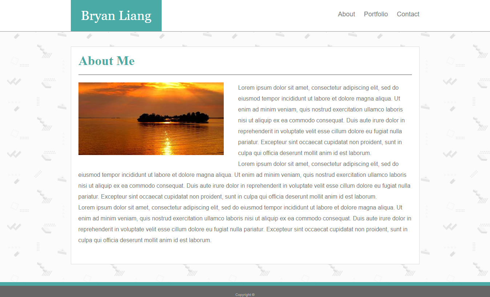

<!-- Put the name of the project after the # -->
<!-- the # means h1  -->
# Basic Portfolio

<!-- Put a description of what the project is -->
Building a professional portfolio while learning how to use basic HTML and CSS.

# Link to deployed site
<!-- make a link to the deployed site --> 
<!-- [What the user will see](the link to the deployed site) -->
[Basic Portfolio](https://liangbryan2.github.io/Basic-Portfolio)

# Images
<!-- take a picture of the image and add it into the readme  -->
<!--  -->


# Technology Used
<!-- make a list of technology used -->
<!-- what you used for this web app, like html css -->


<!-- 
1. First ordered list item
2. Another item
⋅⋅* Unordered sub-list. 
1. Actual numbers don't matter, just that it's a number
⋅⋅1. Ordered sub-list
4. And another item. 
-->
- HTML
- CSS

# code snippets
<!-- put snippets of code inside ``` ``` so it will look like code -->
<!-- if you want to put blockquotes use a > -->

``` html
        <header>
            <div class="header">
                <p class="name">Bryan Liang</p>
                <nav>
                    <a href="index.html">About</a>
                    <a href="portfolio.html">Portfolio</a>
                    <a href="contact.html">Contact</a>
                </nav>
            </div>
            <div class="clear"></div>
        </header>
```
``` css
footer {
    margin-top: 50px;
    position: absolute;
    bottom: 0px;
    width: 100%;
    border-top: #4aaaa5 solid 10px;
    text-align: center;
    font-size: 10px;
    background-color: #666666;
    padding: 20px 0px 1px 0px;
}
```

# Learning points
<!-- Learning points where you would write what you thought was helpful -->
Learning how to change the size of elements and how to position them in relation to each other on the website. Getting the footer to stay at the bottom of the page was the hardest part for me.

# Author 
<!-- make a link to the deployed site and have your name as the link -->
[Bryan Liang](https://github.com/liangbryan2)

# License
Standard MIT License